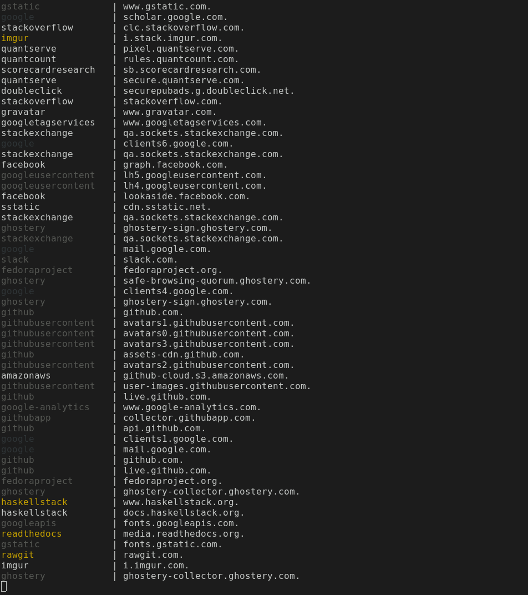

# DNS Monitor on Single Host

### Functionality

Summary: monitor outbound DNS traffic on a single host and process it in a streaming manner

1. Monitor outbound DNS queries through `tcpdump`
2. Deduplicate records such adjacent `A` and `AAAA` records with the same domain name
3. Filter out special record types such as `PTR`
4. Aggregate information from all previously monitored queries
    - How many times the top-level domain (TLD) in the current record is queried
    - How many times the second-level domain (SLD) in the current record is queried
    - Select SLD or TLD as the domain key to print together with the full domain name
    - Color the domain key before printing to stdout regarding how many times it is queried
5. Handle all types of errors and print them to stderr asynchronously
    - Errors from `tcpdump` (the source)
    - Errors in information extraction (invalid records)

### Compilation Environment

[Haskell Stack](https://www.haskellstack.org/)

The latest stack is recommended: if installed with `apt-get` or `dnf`, then stack can be upgraded with `stack upgrade`. The latest stack is usually at `~/.local/bin/stack`.

### Installation

```
make install
```
This command compiles it, copies it to `/usr/bin` and sets appropriate permissions for it to run.

### Usage
```
dnsmonitor
```

### Screenshot



Color coding is based on TLD/SLD hit count ([Config.hs](src/Config.hs)):
```Haskell
colorHit :: Integer -> Text
colorHit h
    | h == 1    = "yellow"
    | h < 16    = "default"
    | h < 128   = "grey"
    | otherwise = "black"
```
